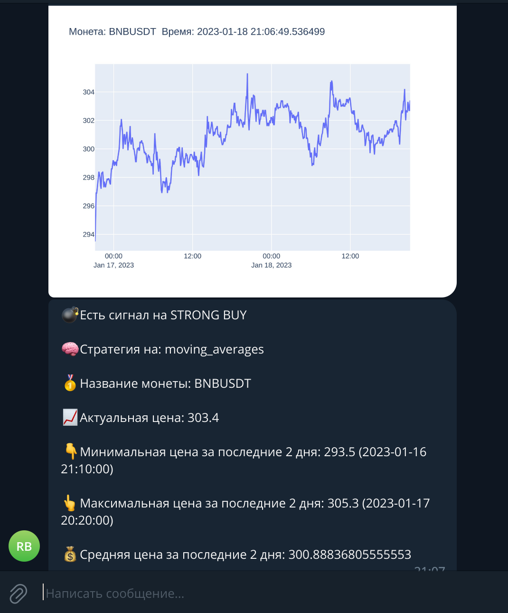

# Инструкция
> Основная задача данного бота скринера;
>> * Подключение к tradingview-ta
>> * Проверка из списка монет (к примеру BTCUSDT, ETHUSDT и тд.) на получение актульной информации по oscillators и moving averages на сигнал STRONG BUY и STRONG SELL
>> * Асинхронное выполнение кода
>> * После получения нужного сигнала провести подробный анализ выбранной монеты
>> * Загрузка исторических данных по выбранной монете за последние 2 дня до момента получения сигнала
>> * Построение графика с использованием plotly и сохранением в папку image/
>> * Вычесляем самую последнию цену закрытия на момент получения данных
>> * Путем математического расчета вычислить минимальную цену за последние 2 дня и время когда это произошло
>> * Путем математического расчета вычислить максимальную цену за последние 2 дня и время когда это произошло
>> * Путем математического расчета вычислить среднию цену за последние 2 дня
>> * И используя библиотеку pyTelegramBotAPI создаем бота который в нужную группу Telegram отправляет всю выше перечисленную информацию
>> * Отправляет ссылку на биржу Binance по выбранной монете

